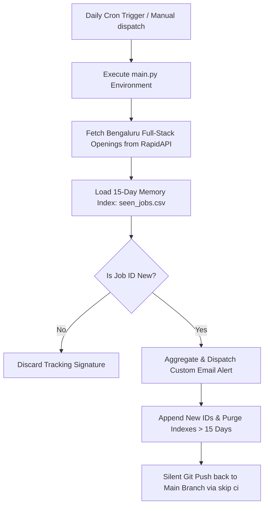

# Automated Job Tracker & Alert Pipeline

[](https://www.python.org)
[](LICENSE)

A cloud-native, serverless Python automation pipeline that dynamically scrapes real-time **Full Stack Developer** jobs in **Bengaluru** daily. It filters out previously seen listings using a rolling 15-day memory buffer and delivers clean, targeted email alerts straight to your inbox via GitHub Actions. **Zero local setup or infrastructure costs required.**

---

## 🚀 Key Features

*   **Automated Daily Scraping:** Fetches real-time Full Stack Developer job listings specifically targeted for the Bengaluru region using the RapidAPI Job Search endpoint.
*   **Smart 15-Day Memory System:** Utilizes a local tracking database (`seen_jobs.csv`) to drop duplicate listings and automatically purge job IDs older than 15 days, keeping the repository lightweight.
*   **Serverless Execution:** Powered entirely by GitHub Actions cron schedules. No local machine dependencies, background processes, or continuous server hosting fees.
*   **Targeted Email Alerts:** Consolidates newly detected job postings into an aggregate report and instantly dispatches it using Python's standard secure SMTP routing.
*   **Loop-Safe State Persistence:** Commits updated job tracking logs back to the repository using a custom `[skip ci]` commit wrapper to securely prevent accidental workflow loops.

---

## 🛠️ Tech Stack

*   **Core Language:** Python 3.9+
*   **Data Processing:** Pandas (for parsing, filtering, and rolling window operations)
*   **API Client:** Requests (handling RapidAPI Job Search interfaces)
*   **CI/CD Orchestration:** GitHub Actions

---

## 📁 Repository Structure

```text
├── .github/workflows/
│   └── main.yml           # GitHub Actions cron scheduler & runner environment
├── .gitignore             # Standard target configurations for Python environments
├── LICENSE                # MIT Open Source License
├── main.py                # Pipeline engine: extraction, historical deduplication, and notification logic
├── requirements.txt       # Engine manifest dependencies (pandas, requests, etc.)
├── seen_jobs.csv          # Tracking registry recording historically processed job configurations
└── seen_jobs_date.txt     # Rolling execution index regulating the 15-day pruning target

```

---

## 🔄 Workflow Architecture



---

## ⚙️ Setup & Configuration

This project is optimized to run natively in the cloud. Follow these setup steps to launch your private automation instance:

### 1. Add Repository Secrets

To keep your sensitive credentials out of the public domain, navigate to **Settings > Secrets and variables > Actions** inside your GitHub repository and input the following configuration secrets:

| Secret Name | Description |
| --- | --- |
| `RAPIDAPI_KEY` | Your unique personal access key for the Job Search API on RapidAPI. |
| `EMAIL_SENDER` | The email address tasked with generating and dispatching the job summaries. |
| `EMAIL_PASSWORD` | The dedicated App Password generated for the sender email (do not use your primary master account password). |
| `EMAIL_RECEIVER` | The inbox address where your custom job alerts should be sent. |

### 2. Grant Workflow Permissions

Because the engine records states dynamically back to the origin repository branch:

1. Navigate to **Settings > Actions > General**.
2. Scroll to the **Workflow permissions** block.
3. Check **Read and write permissions**.
4. Click **Save**.
